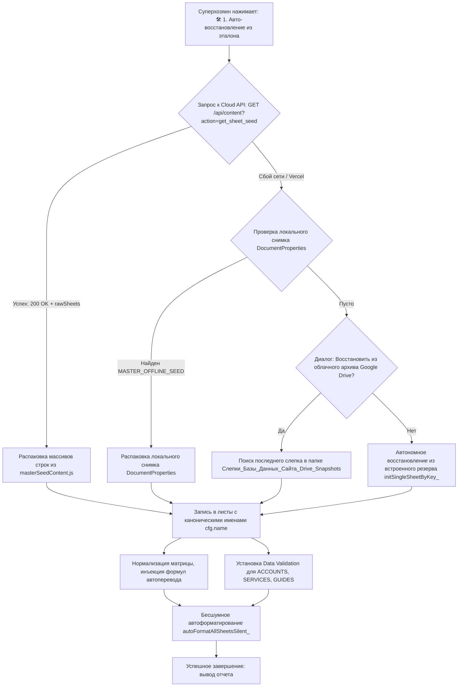

# ПОЛНЫЙ ИСЧЕРПЫВАЮЩИЙ ИНЖЕНЕРНЫЙ ПЛАН: МОДЕРНИЗАЦИЯ ЭКОСИСТЕМЫ, 13 КОЛОНОК ACCOUNTS С UID, ИСПРАВЛЕНИЕ ПЕРЕКЛЮЧАТЕЛЕЙ SERVICES И GUIDES, ТРЕХУРОВНЕВОЕ ВОССТАНОВЛЕНИЕ И УСТРАНЕНИЕ ВСЕХ ВЫЯВЛЕННЫХ НЕСООТВЕТСТВИЙ

## 1. Детальный разбор первопричин и базовые инженерные решения

### 1.1. Проблема 1: Обрезание данных листа ACCOUNTS при выгрузке в masterSeedContent.js
* **Точная первопричина в коде:** В сценарии [scripts/save-master-seed.js](file:///c:/1%20Вилла%20Сайт%20ГлобПрав%20260920261646/villa-turaman-airbnb-platform/scripts/save-master-seed.js#L318-L327) в блоке выгрузки аккаунтов был жестко прописан запрос диапазона `safeFetchRows('ACCOUNTS', 'A:G')` и цикл на 7 итераций `for (let i = 0; i < 7; i++)`. Из-за этого столбцы H, I, J, K, L, M полностью отбрасывались, и в мастер-эталон попадали только первые 7 колонок.
* **Системное устранение:** В `scripts/save-master-seed.js` диапазон расширяется до `A:M` : ровно 13 колонок. Цикл выгрузки сохраняет все 13 значений каждой строки без усечения. В `utils/masterSeedContent.js` массив `MASTER_ACCOUNTS_ROWS` фиксируется в 13-колоночном формате.

---

### 1.2. Проблема 2: Не работают переключатели Вкл/Выкл на листах SERVICES и GUIDES
* **Точная первопричина 1 : Обрезание диапазона чтения GUIDES:** В [utils/liveContentSync.js](file:///c:/1%20Вилла%20Сайт%20ГлобПрав%20260920261646/villa-turaman-airbnb-platform/utils/liveContentSync.js#L211) функция `safeGet` вызывалась с диапазоном `safeGet('GUIDES', 'A:R')`. Лист `GUIDES` содержит ровно 19 колонок : от A до S. Колонка 19 [Колонка S] : это колонка `Наличие` со статусом активности. Из-за запроса `A:R` девятнадцатая колонка S **никогда не считывалась с сервера Google Sheets**. В функции `processRawRowsToContent` значение `r[18]` всегда оказывалось `undefined`, и функция `parseStatusFlag` возвращала значение по умолчанию `true` [Вкл]. Переключение статуса в таблице физически не могло дойти до сайта.
* **Точная первопричина 2 : Отсутствие валидации данных и чекбоксов в Google Sheets:** На листах `🛎️ Дополнительные услуги` [Колонка M] и `🗺️ Видео-путеводители` [Колонка S] не были настроены правила проверки данных Google Таблицы. При вводе пользователем значений в разном регистре или установке интерактивных чекбоксов [TRUE / FALSE] возникали несоответствия.
* **Системное устранение:**
  1. В `utils/liveContentSync.js` диапазон чтения `GUIDES` расширяется до `A:S` [все 19 колонок];
  2. Парсер `parseStatusFlag` в `utils/liveContentSync.js` дополняется строгой поддержкой булевых значений `true`/`false`, строковых вариантов `'true'`/`'false'`, `'вкл'`/`'выкл'`, `'да'`/`'нет'`, `'active'`/`'off'`;
  3. В [Code.js](file:///c:/1%20Вилла%20Сайт%20ГлобПрав%20260920261646/villa-turaman-airbnb-platform/google-apps-script/Code.js) при форматировании листов `SERVICES` и `GUIDES` на колонки активности накладывается валидация данных Google Sheets : выпадающий список `['Вкл', 'Выкл']` либо интерактивный чекбокс Google Sheets `insertCheckboxes()`.

---

### 1.3. Проблема 3: Сбой Cloud API восстановления, сброс имен листов и старые заготовки
* **Точная первопричина 1 : Имена листов:** В [Code.js](file:///c:/1%20Вилла%20Сайт%20ГлобПрав%20260920261646/villa-turaman-airbnb-platform/google-apps-script/Code.js#L3174) вызывался `ss.insertSheet(cfg.canonicalName)`. В объекте `VILLA_SHEETS_CONFIG` свойство названо `name`. Так как `cfg.canonicalName` был `undefined`, Google Sheets создавал листы со стандартными системными именами `Лист2`, `Лист3` и т.д.
* **Точная первопричина 2 : Серверный эндпоинт:** В [pages/api/content.js](file:///c:/1%20Вилла%20Сайт%20ГлобПрав%20260920261646/villa-turaman-airbnb-platform/pages/api/content.js#L31-L57) обработчик `action === 'get_sheet_seed'` считывал `content.json` и возвращал витринные объекты компонентов, но **не содержал сырых двумерных массивов строк всех 15 листов**.
* **Точная первопричина 3 : Скрипт Code.js игнорировал ответ сервера:** В `Code.js` полученный ответ сервера вообще не распаковывался в ячейки. Вместо этого в цикле вызывалась внутренняя функция `initSingleSheetByKey_`, которая содержала старые зашитые в код скрипта заготовки.
* **Системное устранение : Архитектура 4 уровней надежности восстановления данных:**
  * **Уровень 1 [Основной : Cloud API Seed Pull]:** Эндпоинт `/api/content?action=get_sheet_seed` импортирует массивы строк из `masterSeedContent.js` и возвращает готовый объект `rawSheets` со всеми 15 листами. Скрипт `Code.js` распаковывает эти массивы, нормализует прямоугольность данных, заливает в таблицу и накладывает формулы;
  * **Уровень 2 [Автономная локальная память таблицы : DocumentProperties]:** При каждой публикации и при каждом сохранении эталона скрипт сохраняет полный JSON-снимок 15 листов в свойства документа `PropertiesService.getDocumentProperties().setProperty('MASTER_OFFLINE_SEED', ...)`. Если Cloud API недоступен, скрипт восстанавливает листы из `DocumentProperties` мгновенно без внешних запросов;
  * **Уровень 3 [Облачный архив Google Drive]:** Если сервер сайта недоступен, скрипт обращается к последнему JSON-слепку в папке Google Drive `Слепки_Базы_Данных_Сайта_Drive_Snapshots` и восстанавливает актуальные данные;
  * **Уровень 4 [Встроенный резерв initSingleSheetByKey_ в Code.js]:** Функция `initSingleSheetByKey_` полностью переписывается на актуальные данные 2026 года [все 16 блоков витрины, 13 колонок ACCOUNTS, актуальные SERVICES, GUIDES, SETTINGS].

---

### 1.4. Актуализация встроенного резерва initSingleSheetByKey_ : Тройной автоматический контур
* **Инженерное решение:**
  1. **Контур 1 [Из Таблицы командой и автоматически]:** Скрипт сохраняет актуальное состояние 15 листов в `DocumentProperties` таблицы под ключом `MASTER_OFFLINE_SEED`. Выполняется при срабатывании `onSheetEditTrigger` и по кнопке Меню 5: `💾 2. Сохранить текущую таблицу как эталон`;
  2. **Контур 2 [Автоматически в репозитории VS Code через save-master-seed.js]:** Сценарий `scripts/save-master-seed.js` при каждом запуске не только обновляет `masterSeedContent.js`, но и **генерирует актуальный код функции `initSingleSheetByKey_` прямо в `google-apps-script/Code.js`**;
  3. **Контур 3 [Прямой коммит из Google Таблицы в GitHub через REST API]:** В Меню 5 добавляется команда `🐙 5. Прямой коммит masterSeed в GitHub : Ветки main и v1-airbnb через REST API`.

---

### 1.5. Проблема 4: Зависание проводника Google Drive и именование слепков
* **Точная первопричина зависания:** В [Code.js](file:///c:/1%20Вилла%20Сайт%20ГлобПрав%20260920261646/villa-turaman-airbnb-platform/google-apps-script/Code.js#L3461) серверная функция `restoreFromDriveSnapshotFileId_` вызывала `autoFormatAllSheetsInteractive()`. Эта функция внутри вызывает `SpreadsheetApp.getUi().alert(...)`. Когда серверная функция вызывается через `google.script.run` из открытого диалогового HTML-окна проводника, вызов `ui.alert()` блокирует выполнение на стороне сервера, так как интерфейс Google Sheets не может открыть второе модальное окно. В результате скрипт зависал навсегда.
* **Системное устранение:** 
  1. В `restoreFromDriveSnapshotFileId_` вызов `autoFormatAllSheetsInteractive()` заменяется на внутренний метод без диалоговых окон: `autoFormatAllSheetsSilent_()`;
  2. Статус успешного завершения передается в HTML-интерфейс проводника в виде текста в `statusBox`;
  3. Имена файлов слепков Drive стандартизируются по правилу проекта: `ДДММГГГГЧЧмм_Слепок_Базы_Данных_Villa_Turaman.json`.

---

### 1.6. Проблема 5: Паразитный повторный запрос кода верификации при входе гостя
* **Точная первопричина:** В [pages/api/booking.js](file:///c:/1%20Вилла%20Сайт%20ГлобПрав%20260920261646/villa-turaman-airbnb-platform/pages/api/booking.js#L1305-L1335) при `action === 'login'`:
  1. Запрашивался диапазон `A:G`, из-за чего колонки верификации H..L вообще не считывались;
  2. Выполнялось строгое сравнение `(r[2] || '').toString().trim().toLowerCase() === safeContact`. Если в ячейке был составной контакт `789654 | zaomarmaris@gmail.com`, а гость вводил только почту или только телефон, равенство давало `false`;
  3. Не найдя гостя, сервер возвращал заглушку `{ name: 'Гость', contact: safeContact, isHost: false }` со сброшенными флагами `emailVerified: false`, `isVerified: false`;
  4. При переходе в чат или к бронированию сайт требовал повторный код.
* **Системное устранение:** Авторизация переводится на поиск по разделенным колонкам C [телефон] и D [email] с нормализацией цифр и регистра. Считываются колонка I [`Статус верификации`] и колонка K [`Требуется повторная верификация`]. Если аккаунт верифицирован и повторная верификация не запрошена хозяином, вход подтверждается мгновенно без отправки кода.

---

### 1.7. Проблема 6: Письмо с текстом «вставьте код» при тестовом бронировании
* **Точная первопричина:** В [pages/api/booking.js](file:///c:/1%20Вилла%20Сайт%20ГлобПрав%20260920261646/villa-turaman-airbnb-platform/pages/api/booking.js#L2809) при вызове `sendDetailedBookingNotification` передавалось свойство `emailVerified: !!data.emailVerified`. Значение `data.emailVerified` из тела запроса могло быть `undefined`, несмотря на то, что на сервере контакт был подтвержден в кэше `isEmailVerified`. В результате в письме выводился блок предупреждения: «Требуется подтверждение кодом».
* **Системное устранение:** В `booking.js` в уведомление передается вычисленная переменная `isEmailVerified`. В [utils/mailer.js](file:///c:/1%20Вилла%20Сайт%20ГлобПрав%20260920261646/villa-turaman-airbnb-platform/utils/mailer.js#L378) для верифицированных гостей отображается исключительно статус «✓ Подтвержден» и полностью скрываются инструкции по вводу одноразовых кодов.

---

### 1.8. Проблема 7: Разделение Телефона и Email, валидация и редактирование данных хозяином
* **Архитектурное решение с уникальным UID [Колонка M]:**
  * В лист `👤 Гостевые аккаунты` внедряется постоянный неизменяемый ключ строки: **Колонка M: `ID Гостя [UID]`** [значения: `VT-GUEST-1000`, `VT-GUEST-1001` и т.д.];
  * Разделяются столбцы Телефона [Колонка C] и Email [Колонка D];
  * При создании гостя генерируется уникальный `UID`, который сохраняется в сессии и привязывается к чатам;
  * **Правки хозяина:** Хозяин может свободно исправить имя гостя в Колонке B, исправить телефон в Колонке C или email в Колонке D. При любом обращении сервер сначала проверяет соответствие по `UID`. История бронирований, переписка в чате и доступы остаются неразрывными;
  * **Защита ячеек [Data Validation]:** На уровне Google Apps Script настраиваются правила валидации: выпадающие списки `Да`/`Нет` для колонок F, G, H, K; Plain Text `@` для колонок C [телефон], E [пароль] и M [UID]; выпадающие списки статусов для колонок I и L.

---

## 2. Каноническая спецификация 13 колонок листа `👤 Гостевые аккаунты` [ACCOUNTS]

| № | Колонка | Имя заголовка | Тип данных | Пример значения | Назначение и правила валидации |
|---|:-------:|:--------------|:----------:|:----------------|:-------------------------------|
| 1 | **A** | Дата регистрации | `ДД.MM.ГГГГ ЧЧ:мм` | `28.09.2026 15:05` | Дата создания учетной записи : автозаполнение |
| 2 | **B** | Имя | Текст `@` | `Алексей Знаменский` | Имя гостя для персонализации и отображения |
| 3 | **C** | Телефон | Текст `@` | `+90 543 335 80 70` | Номер телефона : Plain Text `@`, защита от формул с плюсом |
| 4 | **D** | Email | Текст `@` | `zaomarmaris@gmail.com` | Адрес электронной почты для уведомлений и входа |
| 5 | **E** | Пароль | Текст `@` | `123456` | Пароль доступа к личному кабинету : Plain Text `@` |
| 6 | **F** | Блок: Сайт | Выпадающий список | `Нет` | Data Validation: `Да` / `Нет`. Полная блокировка доступа |
| 7 | **G** | Блок: Аккаунт | Выпадающий список | `Нет` | Data Validation: `Да` / `Нет`. Блокировка личного кабинета |
| 8 | **H** | Блок: Чат | Выпадающий список | `Нет` | Data Validation: `Да` / `Нет`. Запрет отправки сообщений в чат |
| 9 | **I** | Статус верификации | Выпадающий список | `Email` | Data Validation: `Email` / `Телефон` / `Полная` / `Не верифицирован` |
| 10 | **J** | Дата верификации | `ДД.MM.ГГГГ ЧЧ:мм` | `28.09.2026 15:06` | Дата и время последнего подтверждения кодом |
| 11 | **K** | Требуется повторная верификация | Выпадающий список | `Нет` | Data Validation: `Да` / `Нет`. При установке в `Да` гость обязан подтвердить код |
| 12 | **L** | Статус аккаунта | Выпадающий список | `Активен` | Data Validation: `Активен` / `Архив` / `Удален` |
| 13 | **M** | ID Гостя [UID] | Текст `@` | `VT-GUEST-1001` | **Неизменяемый уникальный идентификатор строки**. Привязка чатов и сессий |

---

## 3. Детальный пошаговый план изменений по файлам и модулям

### ШАГ 1: Обновление реестров и мастер-эталона данных
* **Файл: [utils/sheetsRegistry.js](file:///c:/1%20Вилла%20Сайт%20ГлобПрав%20260920261646/villa-turaman-airbnb-platform/utils/sheetsRegistry.js):**
  * Зафиксировать 13 колонок `ACCOUNTS`: `['Дата регистрации', 'Имя', 'Телефон', 'Email', 'Пароль', 'Блок: Сайт', 'Блок: Аккаунт', 'Блок: Чат', 'Статус верификации', 'Дата верификации', 'Требуется повторная верификация', 'Статус аккаунта', 'ID Гостя [UID]']`;
  * Установить минимальные ширины колонок для `ACCOUNTS`: `[150, 180, 160, 220, 110, 100, 110, 100, 160, 150, 180, 120, 140]`;
  * Зафиксировать 19 колонок `GUIDES` с 19-й колонкой `Наличие` и шириной 100.
* **Файл: [utils/masterSeedContent.js](file:///c:/1%20Вилла%20Сайт%20ГлобПрав%20260920261646/villa-turaman-airbnb-platform/utils/masterSeedContent.js):**
  * Зафиксировать массив `MASTER_ACCOUNTS_ROWS` до 13 колонок для всех учетных записей (`VT-GUEST-1000..1006`);
  * Экспортировать канонический объект `MASTER_RAW_SHEETS` со всеми 15 листами.
* **Файл: [scripts/save-master-seed.js](file:///c:/1%20Вилла%20Сайт%20ГлобПрав%20260920261646/villa-turaman-airbnb-platform/scripts/save-master-seed.js):**
  * В блоке выгрузки аккаунтов диапазон `safeFetchRows('ACCOUNTS', 'A:M')` и цикл на 13 элементов `for (let i = 0; i < 13; i++)`;
  * Добавить автоматическую генерацию и инъекцию обновленного кода `initSingleSheetByKey_` прямо в `google-apps-script/Code.js`.

---

### ШАГ 2: Серверный роутер Cloud API Seed и парсер переключателей в `pages/api/content.js` и `utils/liveContentSync.js`
* **Файл: [pages/api/content.js](file:///c:/1%20Вилла%20Сайт%20ГлобПрав%20260920261646/villa-turaman-airbnb-platform/pages/api/content.js):**
  * В обработчике `action === 'get_sheet_seed'` возвращать объект `rawSheets` со всеми 15 массивами строк напрямую из `masterSeedContent.js`;
  * В обработчике `action === 'save_master_seed'` принимать `livePayload` со всеми 15 листами и синхронизировать файлы `content.json` и `/tmp`.
* **Файл: [utils/liveContentSync.js](file:///c:/1%20Вилла%20Сайт%20ГлобПрав%20260920261646/villa-turaman-airbnb-platform/utils/liveContentSync.js):**
  * Диапазон чтения `GUIDES` : `'A:S'`, обеспечивая считывание девятнадцатой колонки `Наличие`;
  * Функция `parseStatusFlag` со строгой поддержкой булевых типов и нормализацией строковых статусов `'вкл'`/`'выкл'`, `'да'`/`'нет'`.

---

### ШАГ 3: Доработка скрипта Google Таблицы `Code.js`
* **Файл: [google-apps-script/Code.js](file:///c:/1%20Вилла%20Сайт%20ГлобПрав%20260920261646/villa-turaman-airbnb-platform/google-apps-script/Code.js):**
  * **1. Реконструкция функции `restoreSheetsFromCloudApiInteractive`:**
    * Корректное чтение имени листа: `var sheetName = cfg.name || cfg.canonicalName || sKey;`;
    * Если лист отсутствует: `ss.insertSheet(sheetName);`;
    * Пакетная заливка строк и инъекция канонических формул перевода с точкой с запятой `;`;
  * **2. Автоматическое сохранение снимка в `DocumentProperties`:**
    * В `saveMasterSeedInteractive` и `onSheetEditTrigger` вызывать сохранение снимка всех листов в `DocumentProperties`: `PropertiesService.getDocumentProperties().setProperty('MASTER_OFFLINE_SEED', ...)`;
  * **3. Устранение зависания в `restoreFromDriveSnapshotFileId_`:**
    * Использование бесшумного автоформатирования `autoFormatAllSheetsSilent_()` без `ui.alert()`;
    * Стандартизация имен файлов слепков: `ДДММГГГГЧЧмм_Слепок_Базы_Данных_Villa_Turaman.json`;
  * **4. Интеллектуальное форматирование и Data Validation:**
    * Для `ACCOUNTS`: выпадающие списки `['Да', 'Нет']` [F, G, H, K], списки статусов [I, L], Plain Text `@` [C, E, M];
    * Для `SERVICES`: выпадающий список `['Вкл', 'Выкл']` на колонку M [`Наличие`];
    * Для `GUIDES`: выпадающий список `['Вкл', 'Выкл']` на колонку S [`Наличие`];
  * **5. Прямой коммит masterSeed в GitHub через REST API:**
    * Корректная сборка `payload = collectAllSheetsPayload_()`, генерация контента и отправка коммита в ветки `v1-airbnb` и `main`.

---

### ШАГ 4: Логика авторизации, UID и синхронизации правок в `pages/api/booking.js`
* **Файл: [pages/api/booking.js](file:///c:/1%20Вилла%20Сайт%20ГлобПрав%20260920261646/villa-turaman-airbnb-platform/pages/api/booking.js):**
  * **1. Метод авторизации `action === 'login'`:**
    * Запрашивать диапазон `resolveRange(sheetMap, 'ACCOUNTS', 'A:M')`;
    * Сопоставлять входящий логин по телефону, email или `UID`;
    * Если аккаунт верифицирован и повторная верификация не запрошена хозяином, вход подтверждается мгновенно без отправки кода;
  * **2. Сквозное сохранение правок хозяина:**
    * Пользователь идентифицируется по постоянному `UID` [Колонка M], правки имени, телефона или email в таблице сохраняют целостность сессии;
  * **3. Создание нового гостя [`action === 'register'` и авто-регистрация при бронировании]:**
    * Исправить область видимости переменной `newUid`;
    * Записывать в лист `ACCOUNTS` ровно 13 значений в диапазон `A:M`.

---

### ШАГ 5: Корректировка шаблонов писем в `utils/mailer.js`
* **Файл: [utils/mailer.js](file:///c:/1%20Вилла%20Сайт%20ГлобПрав%20260920261646/villa-turaman-airbnb-platform/utils/mailer.js):**
  * Для верифицированных гостей отображать исключительно зеленый бейдж `✓ Подтвержден: контакт проверен`;
  * Полностью исключить пункт с текстом «требуется подтвердить адрес кодом из письма» для подтвержденных гостей.

---

### ШАГ 6: База знаний, Хронология, Задачи VS Code и Отчет
* **Файл: `АРХИТЕКТУРА УЧЕТА ГОСТЕЙ VILLA TURAMAN.md`:**
  * Выпустить Редакцию №7 документа в рабочей директории и накопителе.
* **Файл: [.vscode/tasks.json](file:///c:/1%20Вилла%20Сайт%20ГлобПрав%20260920261646/.vscode/tasks.json):**
  * Синхронизировать задачу Git Pull.
* **Файл: `CHAT_CODE_FIXES_CHRONOLOGY.txt`:**
  * Зафиксировать запись в обоих экземплярах файла хронологии.

---

## 4. Схема многоуровневого восстановления листов таблицы

---

## 5. Базовые критерии приемки

1. **Целостность данных ACCOUNTS:** Выгрузка `save-master-seed.js` сохраняет ровно 13 колонок листа `ACCOUNTS` в `masterSeedContent.js` без обрезания;
2. **Работоспособность переключателей SERVICES и GUIDES:** Изменение статуса на `Выкл` или снятие чекбокса на листах `🛎️ Дополнительные услуги` [Колонка M] и `🗺️ Видео-путеводители` [Колонка S] приводит к корректному скрытию карточки на витрине сайта;
3. **Восстановление через Cloud API:** Команда `🛠️ 1. Авто-восстановление из эталона` восстанавливает удаленный лист с правильным русским названием и наполняет его актуальными строками из `masterSeedContent.js`;
4. **Безотказность встроенного резерва:** Функция `initSingleSheetByKey_` содержит актуальные данные 2026 года для 15 листов;
5. **Стабильность проводника Google Drive:** Модальное окно проводника открывается, отображает список файлов с именами `ДДММГГГГЧЧмм_Слепок_Базы_Данных_Villa_Turaman.json` и восстанавливает любой слепок без зависаний;
6. **Вход без паразитного OTP:** После выхода гость входит по логину и паролю без повторного запроса проверочного кода;
7. **Корректность писем:** В уведомлении о бронировании для подтвержденных гостей отсутствуют ошибочные призывы ввести код;
8. **Ручные правки хозяина:** Изменение имени, телефона или email гостя хозяином в таблице не ломает авторизацию и сохраняет привязку к чату гостя по постоянному `UID`.

---

## 6. Выполнить контрольную проверку: Решение критических вопросов и устранение несоответствий

В данном разделе структурно зафиксированы 8 выявленных инженерных вопросов и точные механизмы их исправления в кодовой базе:

### 6.1. Вопрос 1: Исправление функции `commitMasterSeedToGitHubInteractive` в `Code.js`
* **Выявленная ошибка:** На строке 3679 переменная `payload` не объявлена. При нажатии Меню 5.5 происходит падение скрипта с `ReferenceError: payload is not defined`. Кроме того, путь к файлу в ветке `main` монорепозитория указан неверно (`utils/` вместо `villa-turaman-airbnb-platform/utils/`).
* **Точное решение:**
  1. Перед сборкой `rawSheets` добавить инициализацию: `var payload = collectAllSheetsPayload_();`;
  2. Разделить целевые пути коммита по веткам:
     * Для ветки `v1-airbnb`: путь `utils/masterSeedContent.js` [деплой Vercel из корня ветки];
     * Для ветки `main`: путь `villa-turaman-airbnb-platform/utils/masterSeedContent.js` [полный монорепозиторий];
  3. Обеспечить корректное получение актуального SHA файла перед отправкой PUT-запроса в каждую ветку для предотвращения HTTP 409 Conflict.

### 6.2. Вопрос 2: Реализация автоматической генерации и инъекции кода `initSingleSheetByKey_` в `Code.js` из `scripts/save-master-seed.js`
* **Выявленная ошибка:** В сценарии `scripts/save-master-seed.js` не был реализован блок автоматической генерации заготовок функции `initSingleSheetByKey_` в файле `google-apps-script/Code.js`.
* **Точное решение:**
  1. В `scripts/save-master-seed.js` разработать генератор тела функции `initSingleSheetByKey_`, который берет актуальные выгруженные данные 15 листов [включая 13 колонок ACCOUNTS, все 16 блоков HOME, актуальные SERVICES и GUIDES];
  2. Сценарий находит в файле `google-apps-script/Code.js` блок между маркерами `// === START AUTO-GENERATED initSingleSheetByKey_ ===` и `// === END AUTO-GENERATED initSingleSheetByKey_ ===` и детерминированно замещает его новым кодом;
  3. Теперь при каждом запуске Задачи 6 [npm run save-master-seed] резервные заготовки внутри `Code.js` обновляются синхронно и автоматически.

### 6.3. Вопрос 3: Устранение ошибки области видимости `newUid` при регистрации гостя в `pages/api/booking.js`
* **Выявленная ошибка:** В обработчике `action === 'register'` [строка 1519] переменная `newUid` объявлена через `const` внутри блока `if (sheets && spreadsheetId)`. На строке 1550 вне этого блока обращение к `newUid` вызывает `ReferenceError: newUid is not defined` и аварийный статус HTTP 500.
* **Точное решение:**
  1. Объявить переменную `let newUid = 'VT-GUEST-' + (1000 + Date.now() % 9000);` в начале обработчика `action === 'register'` до блоков проверок;
  2. Внутри блока работы с Google Таблицей переопределять `newUid` на точный порядковый номер по количеству строк;
  3. В ответе клиенту гарантировать 100% безопасную отдачу `uid: newUid`, исключив падение сервера.

### 6.4. Вопрос 4: Перевод системной инициализации `ensureSystemSheets` в `pages/api/booking.js` на 13 колонок
* **Выявленная ошибка:** В строках 990-1004 функция `ensureSystemSheets` при пустом листе `ACCOUNTS` записывала 7 устаревших колонок с испорченным смещением [email в колонку телефона C, пароль в колонку email D].
* **Точное решение:**
  1. Перевести диапазон на `resolveRange(sheetMap, 'ACCOUNTS', 'A:M')`;
  2. Записывать ровно 13 колонок с корректными полями:
     * Запись 1: `['2026-01-15', 'Алексей Знаменский', '+90 543 335 80 70', 'villaturaman@gmail.com', 'admin123', 'Нет', 'Нет', 'Нет', 'Полная', '2026-01-15 12:00', 'Нет', 'Активен', 'VT-GUEST-1000']`;
     * Запись 2: `['2026-05-01', 'Служба консьержа', '+90 532 000 00 01', 'manager@villaturaman.com', 'manager2026', 'Нет', 'Нет', 'Нет', 'Полная', '2026-05-01 10:00', 'Нет', 'Активен', 'VT-GUEST-1001']`;
  3. Исключить порчу структуры таблицы при автоматической инициализации.

### 6.5. Вопрос 5: Расширение диапазона чтения `GUIDES` в методе `get_public_data` в `pages/api/booking.js` до `A:S` и фильтрация активности
* **Выявленная ошибка:** На строке 1024 запрашивался диапазон `A:R` вместо `A:S`, отрезая 19-ю колонку `Наличие`. Кроме того, метод отдавал все записи без проверки статуса активности.
* **Точное решение:**
  1. Изменить диапазон запроса на `resolveRange(sheetMap, 'GUIDES', 'A:S')`;
  2. Считывать значение 19-й колонки `r[18]` [Наличие] и парсить через функцию `parseStatusFlag`;
  3. Для `SERVICES` считывать 13-ю колонку `r[12]` [Наличие];
  4. При формировании ответа метода `get_public_data` добавлять явные поля активности `available: isEnabled`, `status: isEnabled ? 'Вкл' : 'Выкл'`, `enabled: isEnabled`, чтобы клиентские компоненты отсекали выключенные карточки.

### 6.6. Вопрос 6: Исправление смещения колонок в `utils/content.json` и добавление полей активности для услуг и гидов
* **Выявленная ошибка:** В файле `utils/content.json` в массиве `products` значения смещены на одну колонку [цена TRY попала в `image`, а статус `нет` попал в поле `"type": "нет"`, при этом `"available": true`]. В массиве `courses` поля активности вообще отсутствовали.
* **Точное решение:**
  1. Исправить структуру объектов `products` в `utils/content.json`: поле `available` устанавливать строго в соответствии с колонкой таблицы, вернуть корректные ссылки на изображения в `image` и правильные типы в `type`;
  2. В объекты `courses` добавить поля `"available": isEnabled`, `"status": "Вкл"/"Выкл"`, `"enabled": isEnabled`;
  3. Это гарантирует, что даже при первой статической загрузке витрины Next.js выключенные услуги и гиды не появятся на экране.

### 6.7. Вопрос 7: Сквозное обновление данных гостя по UID при ручных правках хозяина в Google CRM
* **Выявленная ошибка:** Браузер гостя сохраняет сессию в `localStorage.getItem('villa_user')` и никогда не запрашивает свежие данные с сервера. Если хозяин в Google Таблице исправил имя, телефон или email гостя, гость видит старые данные до ручного выхода и повторного входа.
* **Точное решение:**
  1. В `pages/api/booking.js` создать легкий эндпоинт `action === 'get_guest_profile'`: принимает `uid`, находит актуальную строку в `ACCOUNTS` по Колонке M и возвращает актуальные `name`, `phone`, `email`, статусы блокировок и верификации;
  2. В `context/AuthContext.js` в хуке `useEffect` при наличии сохраненного `currentUser.uid` в фоне выполнять тихий запрос к `/api/booking?action=get_guest_profile&uid=...`:
     * Если данные в таблице изменились [хозяин исправил имя или телефон], обновить `currentUser` и перезаписать `localStorage`;
     * Если хозяин поставил блокировку [Колонка F или G], немедленно завершить сессию и уведомить пользователя;
  3. Теперь любые ручные правки суперхозяина в Google Таблице автоматически синхронизируются с экраном гостя без необходимости повторного входа.

### 6.8. Вопрос 8: Синхронизация нумерации и названия задачи Git Pull в `.vscode/tasks.json` и документации
* **Выявленная ошибка:** В описаниях упоминалась задача с номером 13, тогда как в `.vscode/tasks.json` она зарегистрирована под номером 26.
* **Точное решение:**
  1. В `.vscode/tasks.json` синхронизировать лейбл задачи: `📥 26. Синхронизация Git Pull : git pull origin main -> Репозиторий GitHub -> Получение свежих коммитов masterSeed и кода`;
  2. Во всех диалоговых окнах Google Apps Script [модальное окно `openGitPullStatusModal`] и отчетах зафиксировать точную и единообразную ссылку на Задачу 26 в VS Code.

